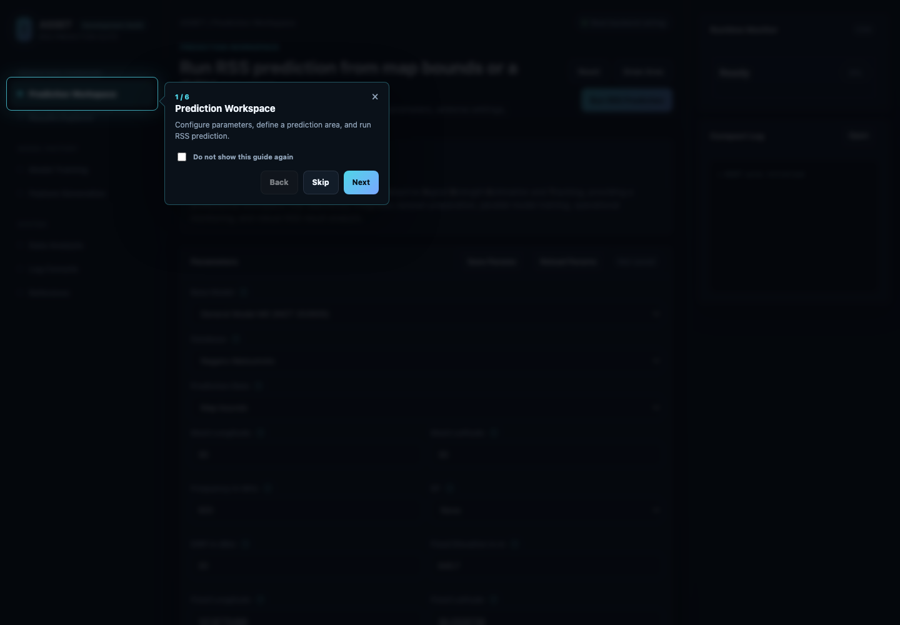
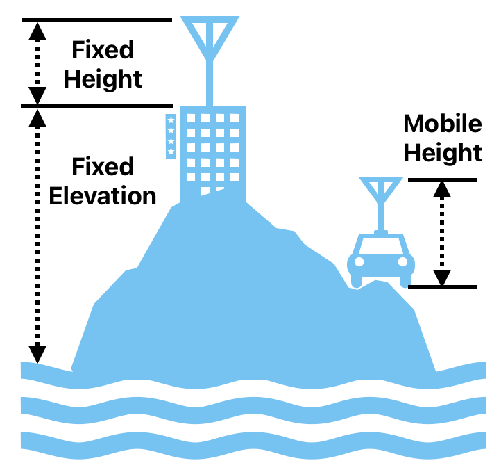

# ASSET Framework App 使用説明書

対象版: 現行 ASSET Framework App  
文書版: v1.2  
更新日: 2026年9月8日  

<!-- pagebreak -->

## 目次

[TOC]

### このマニュアルの進み方

| ステップ | 目的 | 主な画面 |
|---|---|---|
| 1 はじめる | アプリと入力データを準備する | Prediction Workspace |
| 2 予測する | 地図または CSV から RSS を予測する | Prediction Workspace |
| 3 確認する | 結果を地図で見て CSV に保存する | Results Explorer |
| 4 深く調べる | 結果を図にして比較する | Data Analysis |
| 5 学習する | 特徴量と新しいモデルを作る | Feature Generation / Model Training |

<!-- pagebreak -->

## 1. このアプリでできること

ASSET Framework App は、電波の受信信号強度、つまり RSS を地図上で予測し、予測結果を確認し、必要に応じて新しい学習用データやモデルを作るためのアプリです。

難しい専門用語が画面に出ることがありますが、通常の利用では次の流れだけ覚えれば十分です。

1. 予測したい地域、周波数、アンテナ条件を入力します。
2. 地図または CSV ファイルで予測地点を指定します。
3. `Run RSS Prediction` を押して予測を実行します。
4. `Results Explorer` で地図表示を確認し、CSV を保存します。
5. 必要に応じて `Data Analysis` で図を作成します。

### 画面全体の考え方

左側のメニューで作業場所を切り替えます。中央が現在の作業画面、右側が実行状況と簡易ログです。

| 画面 | 主な用途 |
|---|---|
| Prediction Workspace | RSS 予測を実行する |
| Results Explorer | 最新の予測結果を地図で見る、CSV を保存する |
| Model Training | 新しいモデル、転移学習モデル、追加学習モデルを作る |
| Feature Generation | 測定 CSV や地図データから学習用特徴量を作る |
| Data Analysis | 予測 CSV を分析し、図を SVG/PNG で保存する |
| Log Console | 実行ログ、警告、エラーを確認する |
| Reference | 研究上の参考文献を確認する |

画面左側で機能を選び、中央で設定と操作を行います。初回ガイドが表示された場合は、`Next` で各機能の位置を確認するか、`Skip` で閉じてください。

<!-- pagebreak -->

## 2. 利用前に準備するもの

すべての機能を一度に使う必要はありません。まず予測だけを行う場合は、地域、周波数、アンテナ位置が分かれば始められます。

### RSS 予測に必要なもの

| 項目 | 説明 |
|---|---|
| Base Model | 通常は `General Model M0 (NICT 202605)` を選びます。独自モデルを使う場合は `Custom Model` を選びます。 |
| Database | 予測対象地域の地図データです。例: Nagano Matsumoto, Okinawa Naha など。一覧にない地域が必要な場合は、アプリ開発会社へお問い合わせいただくか、今後の更新をお待ちください。 |
| Prediction Data | 地図範囲から作るか、CSV ファイルから読み込むかを選びます。 |
| Frequency in MHz | 使用する無線周波数です。例: 920。 |
| SF | LoRa の Spreading Factor です。不明な場合や使わない場合は `None` を選びます。 |
| EIRP in dBm | 送信条件を表す値です。分からない場合は管理者または測定担当者に確認してください。 |
| Fixed Longitude / Latitude | 固定アンテナの経度と緯度です。 |
| Fixed Elevation / Fixed Height / Mobile Height | アンテナの高さ条件です。 |

### CSV ファイルを使う場合

予測地点を CSV で指定する場合、CSV には経度と緯度の列が必要です。

| 種類 | 使用できる列名の例 |
|---|---|
| 経度 | `longitude`, `lon`, `lng`, `x` |
| 緯度 | `latitude`, `lat`, `y` |
| RSSI | 予測 CSV では任意。学習用 CSV では必要です。列名例: `RSSI`, `rssi` |

### アンテナ高さの見方

次の図は、画面上の `Fixed Elevation`, `Fixed Height`, `Mobile Height` の関係を示します。

| 項目 | 意味 |
|---|---|
| Fixed Elevation | 固定局の設置地点そのものの標高です。 |
| Fixed Height | 設置地点から固定アンテナまでの高さです。 |
| Mobile Height | 移動側アンテナの地面または車両基準からの高さです。 |

<!-- pagebreak -->

## 3. アプリを起動して画面を確認する

アプリを起動すると、最初に ASSET の画面が表示されます。初回は画面案内が出る場合があります。

### 初回ガイド

画面案内では、左メニューや主要ボタンの位置が順番にハイライトされます。

- `Next` を押すと次の説明に進みます。
- `Back` を押すと前の説明に戻ります。
- `Skip` を押すと案内を閉じます。
- `Do not show this guide again` にチェックすると、次回から同じ案内を表示しません。

### 右側の Runtime Monitor

右側の `Runtime Monitor` は、現在の処理の進み具合を表示します。

| 表示 | 意味 |
|---|---|
| Ready | 何も実行していない状態です。 |
| 30%, 40%, 70% など | 予測や学習が進行中です。 |
| Completed | 処理が正常に終わりました。 |
| Error | 何らかの問題で処理が止まりました。 |

処理中に画面が一部操作できなくなることがあります。これは、途中で条件が変わって結果が壊れないようにするためです。

<!-- pagebreak -->

## 4. RSS 予測を実行する

RSS 予測は `Prediction Workspace` で行います。通常はこの画面から作業を始めます。

### 4.1 地図範囲で予測する

地図上の範囲を使って予測する場合は、次の手順で操作します。

1. 左メニューで `Prediction Workspace` を開きます。
2. `Base Model` で使用するモデルを選びます。通常は `General Model M0 (NICT 202605)` です。
3. `Database` で対象地域を選びます。
4. `Prediction Data` を `Map bounds` にします。
5. `Mesh Longitude` と `Mesh Latitude` を入力します。値が大きいほど細かく予測できますが、処理時間も長くなります。
6. 周波数、SF、EIRP、アンテナ位置、高さを入力します。
7. `Draw Area` を押し、地図上で予測したい範囲を指定します。
8. `Run RSS Prediction` を押します。
9. `Runtime Monitor` が `Completed` になるまで待ちます。

> [SUCCESS] `Runtime Monitor` に `Completed` と表示され、`Results Explorer` に `New` が表示されれば予測完了です。

> [WARNING] メッシュ数を大きくすると細かく予測できますが、処理時間と使用メモリも増えます。初回は既定値のまま試してください。

### 4.2 CSV ファイルで予測する

予測したい地点が CSV として用意されている場合は、次の手順で操作します。

1. `Prediction Data` を `CSV file selected by native dialog` にします。
2. モデル、地域、周波数、アンテナ条件を入力します。
3. `Run RSS Prediction` を押します。
4. ファイル選択画面が出たら、予測地点 CSV を選びます。
5. `Runtime Monitor` が `Completed` になるまで待ちます。

CSV で予測する場合、地図上の範囲指定は使いません。CSV の経度・緯度列が予測地点になります。

### 4.3 パラメータを保存して再利用する

同じ条件で何度も試す場合は、`Save Params` と `Reload Params` を使います。

| ボタン | 用途 |
|---|---|
| Save Params | 現在の入力値を一時保存します。 |
| Reload Params | 保存した入力値を画面に戻します。 |
| Reset | 実行中の予測を停止し、予測画面の一時状態を整理します。 |

<!-- pagebreak -->

## 5. 予測結果を見る、CSV を保存する

予測が完了すると、左メニューの `Results Explorer` に `New` の表示が出る場合があります。

### 5.1 最新結果を読み込む

1. 左メニューで `Results Explorer` を開きます。
2. `Load Latest Result` を押します。
3. 地図上に予測結果が表示されることを確認します。

### 5.2 表示を切り替える

結果地図では、次の表示を切り替えられます。

| 表示 | 説明 |
|---|---|
| Prediction RSS | 予測された RSS の強さを色で表示します。 |
| Uncertainty | 予測の不確実さを表示します。 |

`Uncertainty` では `η` の値で、上位・下位の判定範囲を調整できます。専門的な判断が必要な場合は、研究担当者または管理者の指示値を使ってください。

### 5.3 CSV を保存する

1. `Results Explorer` で `Download CSV` を押します。
2. 保存先を選びます。
3. 保存された CSV を表計算ソフトや `Data Analysis` で利用します。

> [SUCCESS] 保存先に CSV ファイルが作成され、表計算ソフトで経度・緯度・予測値の列を確認できれば完了です。

`Download CSV` は、アプリ内部に残っている最新の予測結果を保存します。複数回予測した場合は、最後に成功した結果が対象です。

### 5.4 出力 CSV の列

| 列名 | 意味 |
|---|---|
| Latitude | 緯度。予測地点の南北方向の位置です。 |
| Longitude | 経度。予測地点の東西方向の位置です。 |
| RSSI | 実測した RSS 値です。実測値がない予測用データでは占位値が入る場合があります。 |
| DN | 予測地点の海抜高度です。 |
| FresnelR_H | 水平方向のフレネル半径です。 |
| FresnelR_V | 垂直方向のフレネル半径です。 |
| disBtwTxRx | 送信アンテナと受信アンテナの空間距離です。 |
| Model_0 | 0 号モデルが出力した予測 RSS 値です。 |
| Model_1 | 1 号モデルが出力した予測 RSS 値です。 |
| Predicted_Value | 全モデルが出力した予測 RSS 値の中央値です。 |
| Uncertainty | 全モデルの予測結果から求めた不確実さです。 |
| pathLoss_eta_2 | 古典的な距離減衰モデルによる自由空間向けの予測 RSS 値です。 |
| pathLoss_eta_3 | 古典的な距離減衰モデルによる都市環境向けの予測 RSS 値です。 |

<!-- pagebreak -->

## 6. Feature Generation で学習用データを作る

`Feature Generation` は、測定 CSV や地図データを使って、モデル学習で使う特徴量ファイルを作る画面です。

### 6.1 入力ファイル

| ファイル | 必須 | 説明 |
|---|---:|---|
| Training CSV | 必須 | 測定点の経度、緯度、RSSI を含む CSV です。 |
| Altitude TIFF | 必須 | 標高や地形を表す TIFF ファイルです。 |
| Building GPKG | 任意 | 建物データです。遮蔽や周辺環境の特徴作成に使います。生成には専用の地理データ処理が必要です。 |
| Land-use GPKG | 任意 | 用途地域や土地利用のデータです。生成には専用の地理データ処理が必要です。 |

> [WARNING] `Building GPKG` と `Land-use GPKG` の新規生成は、本 APP の通常機能には含まれません。必要な場合はアプリ開発会社へお問い合わせください。

### 6.2 操作手順

1. 左メニューで `Feature Generation` を開きます。
2. `Dataset Parameters` に周波数、SF、EIRP、固定局位置、高さを入力します。
3. `Training CSV` を押して測定 CSV を選びます。
4. `Altitude TIFF` を押して標高 TIFF を選びます。
5. 必要に応じて `Building GPKG (Optional)` と `Land-use GPKG (Optional)` を選びます。
6. `Upload and Process` を押します。
7. 完了後、`Download Output` が表示されたら押して保存します。

### 6.3 CSV が読み込めないとき

CSV の列名が合わない、空の値が多い、ファイル形式が違う場合は、処理が失敗または一部スキップされます。

最低限、学習用 CSV には次の列が必要です。

| 種類 | 列名例 |
|---|---|
| 経度 | `longitude`, `lon`, `lng`, `x` |
| 緯度 | `latitude`, `lat`, `y` |
| 測定 RSSI | `RSSI`, `rssi` |

<!-- pagebreak -->

## 7. Model Training でモデルを作る

`Model Training` は、特徴量ファイルを使って新しいモデルや転移学習モデルを作る画面です。

### 7.1 まず Feature Vector を用意する

モデル学習には特徴量ファイルが必要です。まだ用意していない場合は、`Open Feature Generation` を押して先に特徴量を作成します。

既に `.xz` 形式の特徴量ファイルがある場合は、`Feature Vector Mode` を `Use existing feature vectors` にして、`Select *.xz Feature Vectors` から選択します。

### 7.2 モデル設定の意味

| 項目 | 説明 |
|---|---|
| Feature Vector Mode | 特徴量を新しく作るか、既存の `.xz` ファイルを使うかを選びます。 |
| Scheduler | 分散実行する場合の Dask scheduler アドレスです。空欄ならローカル実行です。 |
| Base Model | 新規学習、一般モデルからの転移学習、独自モデルからの転移学習を選びます。 |
| Kernel Count | 学習に使用するカーネル数です。値を大きくするとモデル性能が高くなる傾向がありますが、学習速度は低下します。推奨値は `16` です。 |
| Learning Type | `Transfer Learning` を選択します。`Incremental Learning` は今後のアップデートで追加予定です。 |
| Train Judge Model | 転移モデルの性能を判定するための判断モデルを同時に学習します。On にすると計算量が大幅に増えます。主に研究用途向けのため、目的が明確でない場合は Off を推奨します。 |
| Freeze Layer | 転移学習で固定する層を指定します。通常は既定値を使います。 |
| Learning Rate | 学習率の初期値です。通常は既定値 `0.0001` を使います。プログラムは学習の進行に合わせて値を自動的に小さくし、モデルの学習完了まで調整します。 |

### 7.3 学習を実行する

1. `Model Training` を開きます。
2. 特徴量ファイルを用意します。
3. `Base Model` と `Learning Type` を選びます。
4. 分散実行しない場合は `Scheduler` を空欄にします。
5. `Generate Model` を押します。
6. `Runtime Monitor` が `Completed` になるまで待ちます。
7. 保存ダイアログが表示されたら、生成モデルを保存します。

### 7.4 分散実行を使う場合

複数台の PC やサーバで Dask を使う場合は、`Open Guide` を押して手順を確認します。

`Scheduler` には、例として `tcp://host:8786` または `host_ip:8786` の形式で入力します。接続できない場合、アプリはローカル実行に戻ることがあります。

<!-- pagebreak -->

## 8. Data Analysis で図を作成する

`Data Analysis` は、予測結果 CSV を分析し、報告書や論文に使える図を作る画面です。

### 8.1 基本手順

1. 左メニューで `Data Analysis` を開きます。
2. `Prediction CSV Analyzer` が選ばれていることを確認します。
3. `Select Folder` を押し、予測 CSV が入っているフォルダを選びます。
4. 一覧から分析に使う CSV にチェックを入れます。
5. 必要に応じて色を選びます。
6. `Analysis Type` で作りたい図や表を選びます。
7. `Run Analysis` を押します。
8. 画面下部の `Analysis Output` で結果を確認します。
9. `Download SVG` または `Download PNG` を押して保存します。

> [TIP] 拡大して印刷する資料には SVG、メールやスライドに貼る場合は PNG が扱いやすいです。

### 8.2 選べる分析

| Analysis Type | 何を見るためのものか |
|---|---|
| RSSI CDF | RSSI の分布を確認します。 |
| Predicted Value CDF | 予測値の分布を確認します。 |
| Uncertainty CDF | 不確実さの分布を確認します。 |
| Absolute Error CDF | 誤差の大きさの分布を確認します。 |
| Model Error Box Plot | 複数モデルの誤差を箱ひげ図で比較します。 |
| Summary Statistics Table | 平均、中央値などの統計表を作ります。 |
| Predicted vs RSSI Scatter Plot | 実測値と予測値の関係を散布図で確認します。 |
| Error vs Distance Plot | 距離と誤差の関係を見ます。 |
| Error vs Altitude / Fresnel Features | 標高やフレネル関連特徴と誤差の関係を見ます。 |
| Path Loss Baseline Comparison | パスロス基準との比較をします。 |
| Uncertainty Calibration Plot | 不確実さが誤差と対応しているか確認します。 |
| Model Ensemble Violin Plot | モデル群のばらつきを比較します。 |
| Spatial Error Map | 誤差を地理的に確認します。 |

### 8.3 分析できない CSV がある場合

分析ごとに必要な列は異なります。アプリは、必要な列がない CSV をスキップし、理由を表示します。

1つの CSV がスキップされても、ほかの CSV が有効なら分析は続きます。エラーが出た場合は、`Log Console` で詳細を確認してください。

<!-- pagebreak -->

## 9. Log Console を使う

`Log Console` は、アプリ内部の処理状況、警告、エラーを確認する場所です。

### 9.1 ログを見る

左メニューで `Log Console` を開くと、アプリの実行ログを大きな画面で確認できます。右側の `Compact Log` から `Open` を押して開くこともできます。

### 9.2 ログを保存する

1. `Export Log` を押します。
2. 保存先を選びます。
3. `ASSET_application_log_YYYYMMDD_HHMMSS.txt` のような名前で保存されます。

問い合わせや不具合報告をする場合は、保存したログを添付すると原因調査が進みやすくなります。

### 9.3 ログを消す

`Clear Logs` を押すと画面上のログ表示を消せます。処理結果そのものを削除する操作ではありません。

<!-- pagebreak -->

## 10. よくある質問と困ったとき

### 予測結果が表示されません

まず `Results Explorer` で `Load Latest Result` を押してください。それでも表示されない場合は、予測が最後まで完了していない可能性があります。`Log Console` でエラーを確認してください。

### `Download CSV` を押しても保存できません

最新の予測結果がアプリ内部にない可能性があります。もう一度 `Run RSS Prediction` を実行し、完了後に保存してください。

### CSV が選べるのに処理で失敗します

ファイル拡張子が `.csv` でも、必要な列がないと処理できません。経度、緯度、必要に応じて RSSI の列名を確認してください。

### 処理中に別画面へ移動できません

予測、特徴量生成、モデル学習の実行中は、条件変更を防ぐため一部の画面移動が制限されます。ログ画面は確認できます。

### 処理を止めたいです

現在の作業画面に戻り、`Reset` を押してください。実行中の予測または学習を停止し、一時状態を整理します。

### `Custom Model` を選んだらファイル選択が出ます

`Custom Model` には、本ソフトウェアで生成したモデルのみ使用できます。他のソフトウェアや異なる形式で作成したモデルには対応していません。通常利用では `General Model M0 (NICT 202605)` を選んでください。

### 分析図は SVG と PNG のどちらで保存すべきですか

報告書や論文で拡大して使う場合は SVG が向いています。スライド、メール、一般的な資料に貼る場合は PNG が扱いやすいです。

<!-- pagebreak -->

## 11. 用語集

| 用語 | やさしい説明 |
|---|---|
| RSS | 受信した電波の強さです。値が大きいほど受信しやすい傾向があります。 |
| RSSI | RSS とほぼ同じ意味で使われる受信強度の値です。 |
| EIRP | 送信機とアンテナを含めた送信の強さを表す値です。 |
| SF | LoRa 通信で使う Spreading Factor です。通信距離や速度に関係します。 |
| Mesh | 地図を細かい格子に分けて予測するための点や範囲です。 |
| Feature Vector | モデル学習に使う特徴量データです。 |
| Transfer Learning | 既存モデルを使って、新しい地域や条件に合わせて調整する学習方法です。 |
| Incremental Training | 既存モデルに新しいデータを追加して学習を続ける方法です。 |
| Dask | 複数の CPU や複数台のコンピュータで処理を分担する仕組みです。 |
| Uncertainty | 予測結果の不確実さです。値が大きい場所は追加測定の候補になります。 |
| CDF | 値の分布を確認するグラフです。 |
| GPKG | 地図データを保存する GeoPackage 形式です。 |

<!-- pagebreak -->

## 12. 推奨ワークフロー

初めて使う場合は、次の順番がおすすめです。

1. `Prediction Workspace` で既存の `General Model M0` を使い、対象地域の RSS 予測を試します。
2. `Results Explorer` で地図を確認し、CSV を保存します。
3. `Data Analysis` で RSSI CDF や Uncertainty CDF を作り、結果の傾向を確認します。
4. 実測データが増えたら `Feature Generation` で特徴量を作ります。
5. `Model Training` で転移学習モデルを作ります。
6. 新しいモデルで再度予測し、結果を比較します。

重要なのは、予測と分析を一度で終わらせないことです。結果地図と不確実さを見ながら、測定、学習、再予測を繰り返すことで精度を高めます。

<!-- pagebreak -->

## 13. 更新履歴

| 日付 | 文書版 | 内容 |
|---|---|---|
| 2026年9月8日 | v1.2 | ヒラギノ角ゴシックへ変更。全面表紙、実画面、CSV 列説明、モデル学習および地域データに関する注意事項を追加。用語を「不確実さ」に統一。 |
| 2026年9月8日 | v1.1 | Visual Quickstart 版へ改訂。表紙、目次、手順表示、表、ページナビゲーションを再設計。 |
| 2026年9月8日 | v1.0 | ASSET Framework App の現行画面に合わせて、一般利用者向けの日本語使用説明書を新規作成。Prediction Workspace、Results Explorer、Feature Generation、Model Training、Data Analysis、Log Console、用語集、FAQ を追加。 |

## 14. サポート時に伝える情報

問い合わせや不具合報告をする場合は、次の情報を伝えると確認が早くなります。

- 使用している OS
- アプリ画面に表示されているバージョンまたは `Development Build` 表示
- 実行した画面名
- 入力した Database、Frequency、Prediction Data の種類
- エラーが出た場合は `Export Log` で保存したログ
- 使用した CSV の列名

この説明書の更新日: 2026年9月8日
